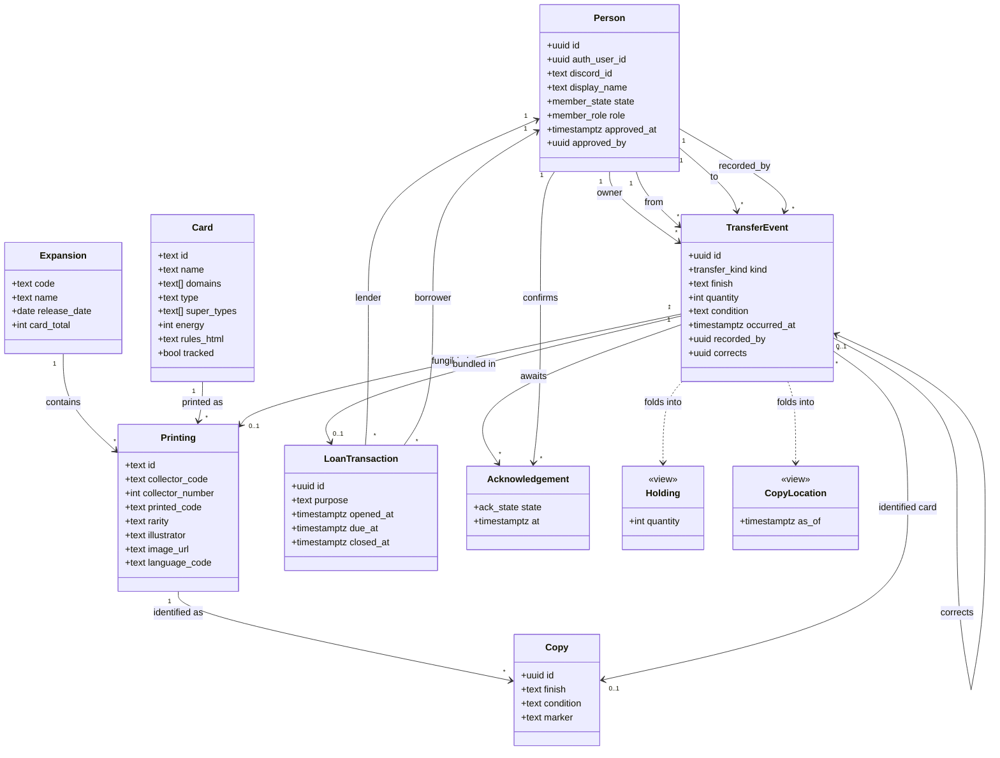

# riftbound-db — design

An exhaustive card index for Riftbound where a small group of friends records what
they own, and, above all, **who lent what to whom**.

Decisions taken, all of them Ruben's:

| | |
|---|---|
| Stack | **Next.js** (App Router) + plain **Postgres**, self-hosted on Hetzner |
| Identity | **Discord OAuth** via Auth.js |
| Granularity | **Hybrid**: fungible quantities by default, identified copies for flagged cards |
| Copy tracking | **Wanted by the group**, not a personal feature. Phase P3 is committed, not speculative. |
| Prices | **Cardmarket** |
| Deployment | **Registration open, membership approved.** Nothing is visible without login and approval (§3) |
| Mixed-stock lends | **Own stock first** (§1.3), though re-lending is now forbidden outright |
| Re-lending | **Not allowed without asking.** Only the owner may record a lend of their card (§1.3d) |

---

## 1. What is actually hard here

The card list is the easy part. Every difficulty in this project comes from the loan
requirement, because a loan is a claim about the physical world made by two people who
may disagree.

### 1.1 Ownership and possession are different things, and both are needed

Ruben *owns* the card. Bob *has* it. A deck Bob is playing may contain cards owned by
three people. Trades move ownership. Loans move possession. Gifts move both.

If the schema has a single "who has it" column, then within a month the app says Ruben
owns 40 cards while his binder holds 30, and there is no way to tell which statement is
wrong. Ownership and possession are therefore two separate axes on every holding row.

### 1.2 A loan is a ledger, not a field

The naive model puts `loaned_to` on the card row. It fails on all five of the things
this project exists to do:

| Requirement | Why the field fails |
|---|---|
| Partial loans | Bob borrowed 2 of your 4 copies. One column cannot hold that. |
| History | "Who had this in March?" is unanswerable once the field is overwritten. |
| Re-lending | Bob lends it onward to Carla. The field says Bob. Reality says Carla. |
| Disputes | Overwriting destroys the record you would need to settle it. |
| Corrections | Editing the past silently rewrites what everyone already agreed. |

The model used here is an **append-only event log**. `transfer_event` is the only
writable table in the domain; current holdings are a fold over it. Nothing is ever
updated or deleted. A mistake is fixed by appending a correcting event that points at
the one it supersedes. This buys history, dispute resolution, and concurrency safety in
one move: two people editing the same card append two rows instead of clobbering one
column.

### 1.3 Fungibility, and the "whose stock moves" ambiguity

Two identical commons are interchangeable: if Bob returns *a* Void Gate, honour is
satisfied. A signed foil alt-art is not interchangeable. The hybrid model works at both
levels at once:

- **Lots** are fungible quantities keyed by `(owner, holder, printing, finish, condition)`.
- **Copies** are identified physical cards with their own IDs, created for cards flagged
  `tracked`.

Fungible quantities leave one awkward case that no schema resolves on its own. It is
worth walking through it concretely, because it is the only place in this design where
the data is genuinely unable to answer a question.

**The situation.** Bob already owns one Void Gate. Ruben lends him a second, identical in
every respect: same set, same number, same finish, same condition. The ledger now says:

```
holding(owner=bob,   holder=bob, OGN-296, normal, NM) = 1
holding(owner=ruben, holder=bob, OGN-296, normal, NM) = 1
```

Bob is holding two pieces of cardboard that are physically indistinguishable, sitting on
the same binder page. Carla asks to borrow a Void Gate and Bob hands one over.

**The question.** Which of those two rows decreases? Every `lend` event has to name an
`owner_id`, because that is the field that says whose stock is moving. There are two
answers, and both are perfectly consistent with what physically happened:

| Bob records | Resulting state | Who chases whom |
|---|---|---|
| `owner = bob` | Bob gave away his own card. Ruben's copy is still with Bob. | Ruben chases **Bob** |
| `owner = ruben` | Bob passed Ruben's card onward. Ruben's copy is now with Carla. | Ruben chases **Carla** |

Bob himself does not know which physical card he handed over, and physically it does not
matter. But the two records lead to different people being asked for the card back. That
is the ambiguity: **fungible cards are interchangeable to the eye but not to the ledger.**

**The decision.** Default to *own stock first, borrowed stock last*. In the example above
Bob's own copy is spent, `owner = bob` is recorded, Ruben's loan to Bob stays open, and
Ruben chases Bob.

Two reasons this is the right default. It matches how people already behave: if you
borrowed something and then passed it on, you are still the one who owes it back. And it
is the conservative choice, because it never quietly removes someone from the chain of
accountability without telling them.

Bob can override when he genuinely means "I am passing Ruben's card to Carla and Ruben
knows". The override is offered only when the lender actually holds mixed stock of that
exact printing, finish and condition, which is uncommon, so in practice the question almost never
appears on screen.

The rule lives in exactly one place: `allocate_lend()` in
[`db/migrations/0001_init.sql`](../db/migrations/0001_init.sql). It returns
the `(owner, quantity)` rows to debit: own stock first, then borrowed stock **oldest loan
first**, with owner ID as a final tiebreak so the ordering is total and the result
deterministic. Oldest first because if two people lent you the same card, the one who has
waited longer is the one whose card should move on. No screen re-derives any of this, and
`tests/allocation_oracle.py` recomputes the expected answers independently of the SQL.

**Copy tracking dissolves this entirely.** For a card flagged `tracked`, Bob is handing
over copy `a3f2...`, not "a Void Gate", so there is nothing to disambiguate. The
own-stock-first rule is therefore a fallback for the untracked long tail of commons, not
the main path for anything valuable enough to argue about.

### 1.3a Finish is a property of the card in your hand, not of the printing

An earlier draft of this design had a `variant` table hanging off `printing`, one row per
finish, taken from Scrydex's published schema. Fetching Riot's own card feed showed that
was wrong: across all 1189 cards there is not one occurrence of "foil", "finish",
"variant" or "premium". The official data has no such concept.

That is not an omission in the feed, it is a fact about where the information lives. A
foil Void Gate and a normal Void Gate are the same printing; whether the piece of
cardboard in your binder is shiny is a property of that object, which only its owner can
report. So `finish` sits on the holding key and on `copy`, alongside `condition`, which
works exactly the same way. The `variant` table is gone and the reference data ends at
`printing`.

One consequence: **`finish` has no authoritative vocabulary.** `normal` and `foil` are
assumed, but Riftbound's actual premium treatments cannot be read off this feed and need
confirming against physical product before the entry UI hard-codes a dropdown.

Note also that `showcase` is a *rarity* in the feed (120 cards), not a finish, and this
was checked rather than assumed. All 102 printings whose collector code ends in `a` have a
plain twin at the same number, and **all 102 have different art from that twin**, usually a
different illustrator and a different rarity: `OGN-007` is a common by Greg Ghielmetti and
Leah Chen, `OGN-007a` a showcase by Fairfoul. The `a` suffix therefore marks a separate
printing, not a finish of the same one, which is precisely what the model already
represents: one `card`, several `printing` rows.

That also settles the 18 identifiers §1.5 flagged for a human decision. They are the same
card printed more than once, so `slug(name)` collapsing them is correct and no
`card_alias` rows are needed. What differs is reminder text, which alternate-art printings
omit for space.

### 1.3b The collector number is not a number

`OGN-007` and `OGN-007a` are both collector number 7. The alternate-art suffix is the
only thing separating them, and 162 of 1189 printings collide this way. Others carry no
plain number at all (`VEN-R04`, `SFD-T03`, `VEN-SP6`) or a star (`SFD-232*`).

So the printed designator is its own column, `collector_code`, and it is what makes a
printing unique within a set and language. `collector_number` survives only for sorting,
because 7 orders correctly against 10 and `007a` does not.

The feed's own `collectorNumber` field really is an integer, which is exactly why the
first schema got this wrong: the source's type was mistaken for the domain's.

### 1.3c `ON CONFLICT` is unusable on a table whose SELECT policy depends on the row

Registration is a read followed by an insert, not an upsert, and the reason is worth
recording because the failure is opaque.

`insert ... on conflict (discord_id) do nothing` on `person` is refused outright, with
`new row violates row-level security policy`. The identical insert without the
`ON CONFLICT` clause succeeds, whether sent as plain SQL or through the extended
protocol; adding or removing columns changes nothing. `make doctor-bisect` runs the
variants side by side.

The likely mechanism: resolving a conflict requires reading the arbiter index, and the
SELECT policy on `person` is `id = current_person() or is_member()`. At first
registration `current_person()` is null, because it resolves *through the very row being
inserted*, so nothing on the table is visible and the speculative insertion cannot be
checked. This is a hypothesis about the internals; the behaviour itself is reproducible.

Reading first works for exactly the reason the conflict path does not: once the row
exists, `current_person()` resolves to it and the SELECT policy admits it. The race
between two simultaneous first logins is caught as a unique violation, which is the
desired end state anyway.

The general shape is worth remembering: **a policy that resolves identity through the
table it guards cannot use that table's conflict machinery during the insert that
creates the identity.**

### 1.3d Re-lending requires asking, and that removes the hard case

Group decision: Bob may not lend Ruben's card to Carla without asking. This is encoded as
a constraint rather than a convention: a `lend` event must have `owner_id = from_id`, so
only the owner can record a lend of their own card. If Carla wants a card Bob is holding
for Ruben, **Ruben records it, and Ruben recording it is the consent.** No separate
request-and-approve flow is required to make the rule real.

It is a `CHECK` rather than a policy, so it binds the owner role and the loader as well as
`app_user`. Only `lend` is constrained: a `return` legitimately has `from_id` set to the
borrower while ownership stays with the lender.

**This dissolves §1.3.** The mixed-stock ambiguity arose only when a lender held
indistinguishable copies belonging to different people and lent one onward. If a lend can
only ever move the lender's own stock, there is nothing to disambiguate.
`allocate_lend()` and its own-stock-first rule remain correct but are no longer load
bearing on this path; they still apply if a lender holds several of their own copies in
different conditions. Relaxing this decision later means building the
request-and-acknowledge flow first, and §1.3 becomes live again the moment it is relaxed.

### 1.3e A legend's card name is not what anyone calls it

Legend cards are named by epithet alone: `Blind Monk`, `Nine-Tailed Fox`, `Daughter of the
Void`. The champion is in `tags` instead, as `Lee Sin`, `Ahri`, `Kai'Sa`. Unit champions
are the opposite, carrying both: `Darius, Trifarian`.

So a decklist saying "Lee Sin, Blind Monk", or just "Lee Sin", matches no card by name,
and the cards are present the whole time. Resolution therefore accepts three spellings for
a legend: the card name, `Tag, Name`, and the bare tag.

Two checks made this safe rather than hopeful. No synthesised `Tag, Name` collides with a
real card name, across all 1189 printings. And exactly one champion tag is ambiguous:
`Master Yi` names two different legends. Rather than special-case it, any spelling that
resolves to more than one card is dropped, so it stays unmatched and is reported. Guessing
would understate what is missing, which is the one error this feature must not make.

### 1.4 Everything is self-reported, so trust is the real design problem

Nobody can verify a claim. Ruben says he lent it; Bob says he gave it back. This is not a
database problem, it is a social one, and the schema's job is to make disagreement
**visible** rather than to silently pick a winner.

Mechanism: a loan is `proposed` by whoever recorded it, and the counterparty may `confirm`
or `dispute` it. Acknowledgement attaches to the **loan transaction**, not to each event:
you lend a deck, and asking someone to confirm forty cards separately guarantees they
confirm nothing. Only the borrower's position is tracked, since the lender's is implicit
in having recorded the loan. Holdings are computed optimistically from proposed events so
the app is usable immediately, but anything unconfirmed carries a badge, and a disputed
event shows both parties' positions side by side. Add append-only storage on top and the
inconvenient loan record cannot quietly disappear.

### 1.5 Card identity across reprints

Scrydex keys cards by set-scoped ID (`OGN-296`). When a card is reprinted in a later set
it gets a different ID, and "do I own Void Gate?" silently becomes a join. Magic solves
this with a stable *oracle ID* per abstract card; Riftbound has no published equivalent.

So one must be minted, and every minting rule is imperfect:

- `slug(name)` alone collides if two distinct cards ever share a name.
- `slug(name) + hash(rules)` splits a card in two the moment its text is errataed.

The approach taken: mint `card.id` from the name slug, store `rules_hash` alongside, and
keep a small hand-maintained `card_alias` mapping for the cases that go wrong. The
important part is that this is an **explicit, reviewable decision recorded in git**, not
an accident of the loader. Expect to touch it at each new set release.

### 1.6 Bulk entry is what kills projects like this

Nobody enters 300 cards through one checkbox at a time. If first-time entry takes an
evening, the data is stale within a month and the app is dead. This deserves more design
effort than the schema does:

- A set grid with `+`/`-` steppers, keyboard-driven, all state local until saved.
- The **same** grid and the same filters as browsing. Two screens over one dataset produce
  two filter bars that drift apart, and the one that drifts is always entry, which is the
  screen that needs name search most: you look up the card in your hand, you do not browse
  to it. `/cards?edit=1` is the whole difference.
- Paste a deck list as text, resolve names to printings, import in one action.
- Optimistic writes with an offline queue, because entry happens on a phone, on the
  floor, next to a binder, on someone else's wifi.
- "I own a full playset of this set" as a single action.

### 1.7 The card data source, and why the art is not ours

Card data comes from **Riot's own site**. `playriftbound.com` is a Next.js application,
so its card gallery is served as JSON at

```
https://playriftbound.com/_next/data/{BUILD_ID}/{LOCALE}/card-gallery.json
```

Verified working: 1189 cards across five sets (Origins 352, Unleashed 288, Spiritforged
288, Vendetta 237, Proving Grounds 24), no authentication, no key, 3.25 MB. The `id` and
`publicCode` fields are both unique across the whole feed.

This beats the third-party APIs on every axis that matters here. **Scrydex has no free
tier**: plans start at $29/month for roughly 160 requests a day. More importantly, Riot's
policy requires official card text to be displayed, and taking the text from Riot's own
feed satisfies that directly rather than by trusting an intermediary.

The cost is fragility. `BUILD_ID` changes whenever Riot redeploys the site, so the fetcher
must scrape it from the page first. The JSON shape is an internal implementation detail
and can change without notice or deprecation. Note the domain has already moved:
`riftbound.leagueoflegends.com` now redirects to `playriftbound.com`.

That fragility is survivable **only because the data is vendored**, which is the reason
the architecture was built that way before any of this was known:

- `scripts/fetch-cards.ts` writes sorted, stable JSON into `data/cards/<SET>.json`, which
  is committed. A new set arrives as a reviewable diff. Output must be byte-stable across
  runs or the diffs are worthless: `make determinism` checks this.
- The app reads Postgres, populated from those files. It never calls Riot at request
  time. If the feed breaks, new sets cannot be ingested; the running site is unaffected.
- Locale is a fetch parameter, so translations are one more run per language. The site
  geo-redirects, which is worth knowing when testing from Belgium: requesting the bare
  domain returned `fr-fr`.

Prices are a separate problem with a separate source, **Cardmarket**, chosen because the
playgroup is European and Cardmarket is what they would actually check. It is a paid third
party and it is not on the critical path: everything through P3 works without it.

**The art is not ours.** Card images are Riot intellectual property, served from
`cmsassets.rgpub.io`. Store URLs, render from that CDN, cache locally under `data/images/`
which is gitignored. Access is gated behind approval, which lowers the exposure
considerably, but the obligations in §6 still apply.

### 1.8 Drift between the ledger and the binder

Even with a perfect log, reality diverges: a card is misfiled, a loan is forgotten, a
trade happens at a table and nobody opens their phone. The fix is a periodic stocktake
that appends a `stocktake` adjustment event with a mandatory reason, rather than editing
history. The size of the adjustments is itself a useful signal about how much the ledger
is trusted.

### 1.9 Smaller considerations, named so they are not rediscovered later

- **Bundles.** You lend a deck, not 40 cards. One `loan_transaction` groups the line
  items so there is one due date and one acknowledgement. Nobody will confirm 40 loans.
- **Chains.** Ruben to Bob to Carla. Ownership stays with Ruben; possession moves. Ruben
  chases Carla, or Bob, depending on group etiquette. Encode whether re-lending without
  owner consent is permitted as a flag; do not hard-code the answer.
- **Condition.** NM/LP/MP is part of the lot key, otherwise returning a played card for a
  mint one is invisible.
- **Language.** Riftbound prints in several languages and a Belgian playgroup will mix
  them. Language belongs in the printing key, not as a display preference.
- **Decks** are a soft claim on availability: a card in Bob's built deck is technically
  lendable but socially is not. Model later, as a view over holdings.
- **Prices** are volatile third-party data. Cardmarket snapshots are stored timestamped
  with the source recorded, and are never treated as authoritative. Their only real job
  is answering "how much do I care that this never came back". A snapshot is a historical
  fact about a market, not a fact about the card.
- **Sealed product** (boxes, precons) is explicitly out of scope for v1.
- **Loss.** A `lose` event writes the card off and closes the loan. Whether the borrower
  owes a replacement is a conversation, not a column.

---

## 2. Class diagram

Three layers, deliberately separated: reference data that is vendored and read-only,
the append-only ledger, and views derived from it.



The executable form of this diagram is [`db/migrations/0001_init.sql`](../db/migrations/0001_init.sql),
which is the single source of truth. The diagram above is documentation; if the two ever
disagree, the SQL wins.

### Why `TransferEvent` carries both `owner_id` and `from_id`/`to_id`

`from`/`to` are possession. `owner` says whose stock is being moved. On a `lend` the owner
is unchanged and only possession moves, so `owner_id` stays the lender's owner (which may
be a third party in a re-lend chain). On a `give` or `trade` the owner changes with it.
Keeping the three separate is what makes chains and mixed stock representable at all.

### Event kinds and their effect

| kind | ownership | possession | note |
|---|---|---|---|
| `acquire` | to actor | to actor | bought, pulled, or entered at first stocktake |
| `lend` | unchanged | from → to | the loan; belongs to a `loan_transaction` |
| `return` | unchanged | to → from | closes a loan line |
| `give` | to recipient | to recipient | gift |
| `trade` | swaps | swaps | two legs sharing one transaction |
| `lose` | written off | written off | closes any open loan on it |
| `destroy` | written off | written off | damaged beyond use |
| `stocktake` | adjustment | adjustment | reconciliation, reason mandatory |

### Invariants

These belong in tests, and the ones that can be are enforced as constraints:

1. Every lot quantity is `>= 0`. A negative holding is a bug, never a display state.
2. For any `(owner, printing, finish, condition)`, the sum over all holders equals the amount
   acquired minus the amount written off.
3. `lend` requires the lender to currently *hold* at least that quantity. Holding, not
   owning: re-lending is legal.
4. Ownership is invariant under `lend` and `return`.
5. `transfer_event` rows are never updated or deleted. Enforced by RLS, not convention.
6. Every event references a fungible lot **or** an identified copy, never both and never
   neither.

---

## 3. Access control

Anyone with a Discord account may register. Nobody sees anything until Ruben approves
them, and that includes the card list. The site is reachable from the open internet; none
of its data is.

| State | Can see |
|---|---|
| Not logged in | The login page |
| `pending` | Its own row, so the app can say "waiting for approval". Nothing else. |
| `approved` | All cards, all holdings, all loans. May record events. |
| `suspended` | Same as pending. Existing ledger history is untouched. |

A pending account seeing only its own row is deliberate. If pending users could read the
card tables, an unapproved stranger would still get the whole index; if they could read
`person`, they would get the membership list. So the gate is `is_member()`, which means
*approved*, and it sits on every table including reference data.

Three rules carry the weight:

1. **You may create only your own row, only as `pending`.** The insert policy forbids
   setting `role` or `approved_at`, so nobody can self-approve or self-promote.
2. **`recorded_by` is forced to the caller's own ID**, and you must be a party to the
   event you record: one of `from`, `to` or `owner`.
3. **No update or delete policy exists on `transfer_event`**, so both are denied to every
   role that passes through RLS. Corrections append. This is what makes an inconvenient
   loan record impossible to quietly remove, and it is the most valuable security
   property in the design.

**People are never deleted.** The ledger references them by ID and it is append-only, so
a member who leaves is `suspended`, not removed. Old loans keep naming them, which is
correct: the history of who owed what should not change because someone left the group.

**Bootstrap footgun.** A fresh database has no admin, so nobody can approve anybody,
including you. Log in once with Discord to create your own pending row, then run
`make promote DISCORD_ID=...`, which connects as the owner role and bypasses RLS.

### How identity reaches Postgres, and what it is worth

There is no `auth.uid()` on plain Postgres. Auth.js authenticates the user, and the
application then *asserts* who they are with a transaction-scoped session variable:

```sql
begin;
set local app.discord_id = '<discord user id>';
-- ... queries ...
commit;
```

The **Discord id** is asserted, not the person id. It is what the OAuth exchange
verifies, and, decisively, it exists before the person row does: at first login there is
no person id to assert and no way to look one up, because reading `person` requires
already knowing which row is yours. `current_person()` resolves the assertion to a row.

In code this is `asUser()` in [`lib/db.ts`](../lib/db.ts), and it is the only place
that opens a connection to a domain table. Note that it calls
`set_config('app.discord_id', $1, true)` rather than interpolating a `SET LOCAL`
statement: `set local app.discord_id = $1` cannot take a bound parameter, and building
that string by hand would put an injection point on the value that decides what the
caller may see.

`set local` is discarded at commit or rollback. That is the whole reason it is safe
behind a connection pool: a pooled connection cannot carry one user's identity into the
next user's request. A plain `set` would, and that is the bug to watch for. Every query
path must go through one wrapper that opens the transaction and sets the variable; a
query issued outside that wrapper is the failure mode to test for.

**This is weaker than it looks, and it is worth being honest about.** Postgres is no
longer verifying a signed token, it is believing what the application tells it. RLS here
is defence in depth against a missing `WHERE` clause in application code, not a
cryptographic boundary. If the app asserts the wrong person ID, Postgres will enforce the
wrong identity perfectly. The boundary that actually authenticates the user is Auth.js.

What it still buys, and the reason to keep it: a forgotten filter in a query returns
nothing instead of everyone's collection, and no application bug can make
`transfer_event` mutable, because the privilege was never granted.

It fails closed. With no variable set, `current_person()` is null, `is_member()` is false
and every policy denies, so a missed `set local` produces an empty page rather than a
leak. Prefer that failure mode to any scheme that defaults to a visible row.

**Two database roles.** `app_user` is what the web app connects as and is subject to RLS.
Migrations and the card loader connect as the owner, which bypasses RLS by design.
`app_user` must never own the tables, because a table owner bypasses row-level security
and the whole model would quietly evaporate.

**Suspension takes effect immediately** even though Auth.js sessions are stateless,
because `is_member()` reads `person.state` from the database on every query. A suspended
member holding a valid session token can still log in and sees exactly what a pending
member sees: their own row.

## 4. Roadmap

Each phase is independently useful, which matters because a project like this dies if the
first useful thing is six weekends away.

Approval gating reorders the front of this. Nothing is visible without an approved
account, so there is no such thing as a useful deploy before auth exists. P0 is therefore
a local milestone rather than a release, and the first deploy is P1.

| Phase | Deliverable | Proves |
|---|---|---|
| **P0** *(local only)* | Fetch and vendor OGN, load into Postgres, set grid on localhost | The card data pipeline and its diffs |
| **P1** *(first deploy)* | Discord OAuth, registration, admin approval queue, own-collection quantities, fast bulk entry | That anyone will actually enter their collection |
| **P2** | Loan ledger, bundles, acknowledgement, "who has my cards" and "what do I owe" | The actual point of the project |
| **P3** | Identified copies for cards flagged `tracked` | Foils, disputes, and unambiguous lends |
| **P4** | Decks, Cardmarket snapshots, overdue nudges, stocktake flow | Convenience, none of it load-bearing |

The **admin approval queue** is now a screen in P1, not a schema field: a list of pending
registrations with approve and reject actions. Small, but it blocks every other user.

P3 is committed rather than speculative, since the group wants copy-level tracking. Two
consequences worth planning for now rather than discovering in P3:

- **Which cards default to `tracked`.** Flagging by hand does not scale and flagging
  everything destroys entry ergonomics. A defensible default rule is *any foil, plus
  anything whose latest Cardmarket snapshot exceeds a threshold*, with a manual override
  either way. Note the coupling: that rule pulls Cardmarket from P4 into P3.
- **Copy condition changes over time** as a card gets played. That is not a transfer, so
  it does not belong in the append-only ledger; `copy.condition` is simply mutable. It is
  the one deliberate exception to "nothing is ever updated", and it is called out here so
  it does not read as an oversight.

The riskiest phase is still **P1**, and the risk is not technical. If bulk entry is not
genuinely pleasant, there is no data and the rest never matters.

## 5. Still open

1. **The `tracked` default rule** in §4, which decides how much of Cardmarket lands in P3.
2. **Rejection.** `member_state` has `pending`, `approved` and `suspended`, but no
   `rejected`. A rejected registration currently just stays pending forever, which is
   quiet but leaves no record and lets someone re-request indefinitely. Adding a fourth
   state is trivial; whether you want the friction is a group question.

## 6. Obligations of a fan project

Access is approval-gated, so this is a closed group rather than a public card database.
That lowers the exposure substantially: nothing is indexed, nothing is browsable by
strangers, and there is no audience beyond the people invited. The obligations do not
disappear, because the site is still reachable and still built on someone else's
intellectual property.

- **Riot legal notice.** Riot asks community projects to state that they are not endorsed
  by Riot Games and do not reflect Riot's views, and to acknowledge Riot's trademarks.
  Take the current wording from Riot's own legal page at deploy time rather than copying
  it from memory or from another fan site.
- **Official card text.** Riot's Riftbound API policy requires the official English text,
  or Riot's translation where available, to be displayed. The loader must not paraphrase,
  reformat or truncate rules text.
- **Art is referenced, never rehosted.** Images render from the official CDN. The local
  cache under `data/images/` is gitignored and must not be deployed.
- **No commercial framing.** No ads, no affiliate links on Cardmarket prices.
- **Data source terms.** Scrydex, apitcg and Cardmarket each have their own; check them
  before inviting anyone, not after.

**This section needs Ruben's own reading of Riot's current legal page.** It is a legal
judgement rather than a technical one, and it is not something to take on trust from a
generated document.
